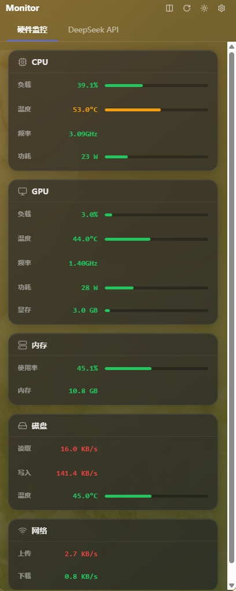
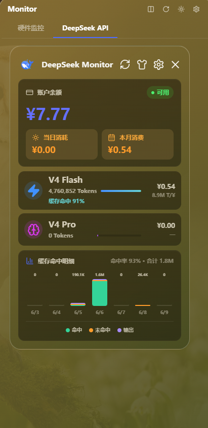
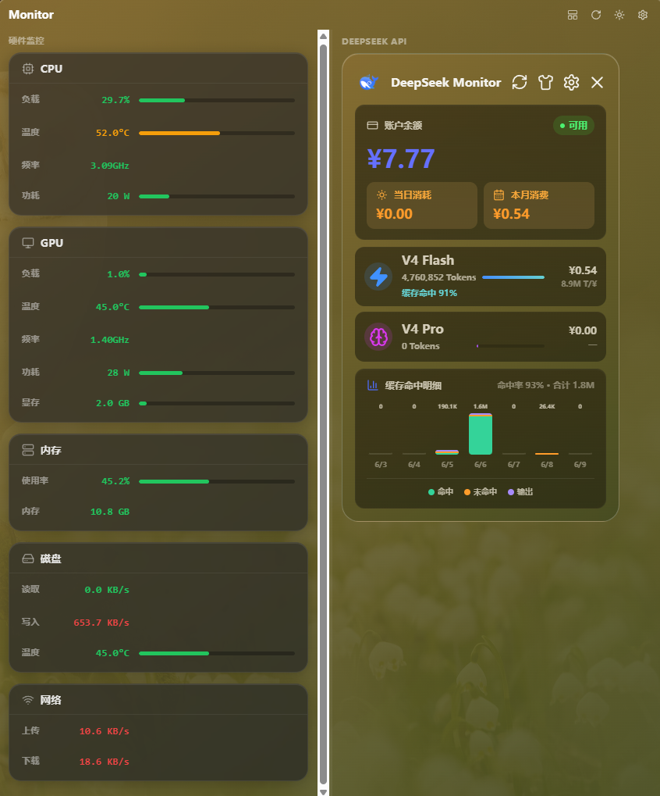

# DeepSeek Monitor Windows

> 本项目由 AI 辅助构建，以 [Joyi-code/DeepSeekMonitorWindows](https://github.com/Joyi-code/DeepSeekMonitorWindows) 为基础，硬件监控功能参考了 [Diorser/LiteMonitor](https://github.com/Diorser/LiteMonitor) 的实现思路。

一款集 **DeepSeek API 监控** 与 **硬件传感器监控** 于一体的 Windows 桌面应用。支持实时查看 DeepSeek 账户余额、Token 消耗、缓存命中率，以及 CPU、GPU、内存、磁盘、网络等硬件状态。

---

## 截图

### 标签页模式 — 硬件监控



### 标签页模式 — DeepSeek API



### 双列分屏模式



---

## 功能特性

### DeepSeek API 监控
- 账户余额实时显示
- V4 Flash / V4 Pro 模型 Token 消耗统计
- 缓存命中率趋势图表
- 当日消耗 / 本月消费汇总

### 硬件监控
- **CPU**：负载、温度、频率、功耗
- **GPU**：负载、温度、频率、功耗、显存占用
- **内存**：使用率、已用容量
- **磁盘**：读写速度、温度
- **网络**：上传 / 下载速度

### 视图模式
- **标签页模式**（默认）：420×640 窄窗，Tab 切换
- **双列模式**（Ctrl+\）：860×800 宽窗，左右分屏同时展示
- 拖拽分割线调整左右比例

### 主题
- 支持日间 / 夜间双主题切换
- 玻璃拟态（Glassmorphism）UI 设计

---

## 系统要求

| 项目 | 要求 |
|------|------|
| 操作系统 | Windows 10 / 11 (x64) |
| 运行时 | .NET 8.0 Runtime（硬件监控需要） |
| WebView2 | Microsoft Edge WebView2 Runtime |
| 权限 | **建议以管理员身份运行**，以获取完整的硬件传感器数据 |

> **管理员权限说明**：部分硬件传感器（如 CPU 温度、磁盘温度、主板传感器等）需要管理员权限才能读取。普通用户模式下，部分数据可能显示为 `--` 或缺失。

---

## 安装

1. 下载 `DeepSeekMonitorWindows_1.1.0_x64-setup.exe`
2. 双击运行安装程序
3. 选择安装目录（默认 `C:\Program Files\DeepSeekMonitorWindows`）
4. 安装完成后，从开始菜单或桌面快捷方式启动

> 首次启动建议右键图标选择 **"以管理员身份运行"**，以获取完整的硬件监控数据。

---

## 使用说明

### 快捷键

| 快捷键 | 功能 |
|--------|------|
| `Ctrl + \` | 切换 标签页模式 / 双列模式 |
| `Ctrl + Tab` | 在 硬件监控 / DeepSeek API 标签页之间切换 |

### 配置 DeepSeek API

1. 点击右上角 **设置** 图标（齿轮）
2. 输入你的 DeepSeek API Key
3. 点击保存，系统将自动获取账户信息

### 硬件监控启动

硬件监控 Sidecar 进程会在应用启动时自动运行，无需手动干预。如果传感器数据长时间显示"等待传感器数据"，请检查：
- 是否以管理员身份运行
- `.NET 8.0 Runtime` 是否已安装

---

## 项目架构

```
DeepSeekMonitorWindows/
├── HardwareSidecar/              # C# .NET 8 硬件采集 Sidecar
│   ├── Program.cs                # 入口点（隐藏控制台窗口）
│   ├── HardwareMonitorService.cs # 传感器调度核心
│   ├── ComponentProcessor.cs     # CPU/GPU 复合值处理
│   ├── PerformanceCounterManager.cs # Windows 性能计数器
│   ├── NetworkManager.cs         # 网络适配器管理
│   ├── DiskManager.cs            # 磁盘传感器管理
│   ├── SensorMatcher.cs          # 传感器名称匹配规则
│   ├── OutputFormatter.cs        # JSON Lines 输出格式
│   └── ...
│
├── src/                          # React + TypeScript 前端
│   ├── components/
│   │   ├── HardwareDashboard.tsx # 硬件监控面板
│   │   ├── HardwareSensorGroup.tsx
│   │   ├── HardwareSensorRow.tsx
│   │   ├── TitleBar.tsx          # 自定义标题栏
│   │   └── ViewSwitcher.tsx      # 视图切换按钮
│   ├── utils/
│   │   ├── hardwareFormat.ts     # 传感器数值格式化
│   │   └── hardwareThresholds.ts # 阈值与颜色规则
│   ├── main.tsx                  # 主入口（含视图状态管理）
│   └── styles.css                # 全局样式（含硬件监控主题）
│
├── src-tauri/                    # Tauri 2 Rust 后端
│   ├── src/
│   │   ├── lib.rs                # 主库（命令注册、状态管理）
│   │   ├── sidecar.rs            # Sidecar 进程管理器
│   │   └── main.rs               # 入口点
│   ├── tauri.conf.json           # Tauri 配置
│   └── capabilities/
│
├── scripts/                      # 开发/构建脚本
│   ├── tauri-dev.cjs             # 智能开发启动器（端口自动检测）
│   ├── build.ps1                 # 生产构建脚本
│   └── env.ps1                   # 环境变量初始化
│
└── docs/screenshots/             # 项目截图
```

### 技术栈

| 层级 | 技术 |
|------|------|
| 前端 | React 18 + TypeScript + Vite |
| 桌面框架 | Tauri 2 (Rust) |
| 硬件采集 | C# .NET 8 + LibreHardwareMonitorLib |
| 打包 | NSIS 安装程序 |

### 数据流

```
LibreHardwareMonitorLib (C#)
        |
        v
HardwareSidecar.exe  → stdout JSON Lines
        |
        v
Tauri SidecarManager (Rust)  → 解析 JSON
        |
        v
hardware:sensors 事件  → React 前端
        |
        v
UI 渲染（HardwareDashboard / HardwareSensorRow）
```

---

## 开发环境

### 前置要求

- Node.js 22+
- Rust + cargo
- .NET 8.0 SDK
- Windows 10/11

### 安装依赖

```bash
npm install
```

### 开发模式启动

```bash
npm run tauri:dev
```

> 开发启动器会自动检测端口占用（5180–5299），被占用时会自动切换到下一个可用端口。

### 生产构建

```bash
npx tauri build
```

构建产物位于 `src-tauri/target/release/bundle/nsis/`。

---

## 许可证

MIT

---

## 致谢

- [Joyi-code/DeepSeekMonitorWindows](https://github.com/Joyi-code/DeepSeekMonitorWindows) — 基础框架与 DeepSeek API 监控功能
- [Diorser/LiteMonitor](https://github.com/Diorser/LiteMonitor) — 硬件监控数据采集参考
- [LibreHardwareMonitor](https://github.com/LibreHardwareMonitor/LibreHardwareMonitor) — 开源硬件传感器库
